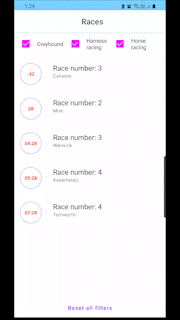
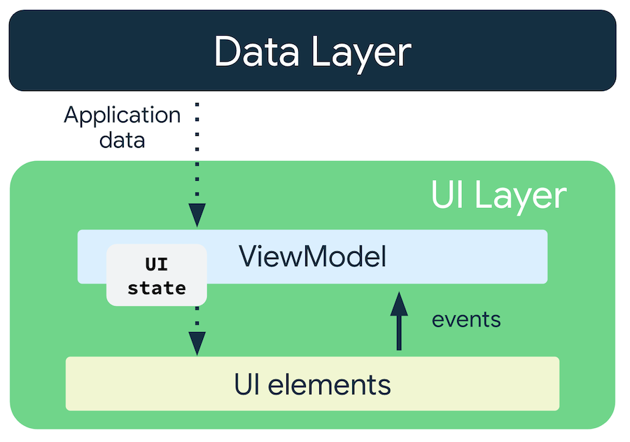
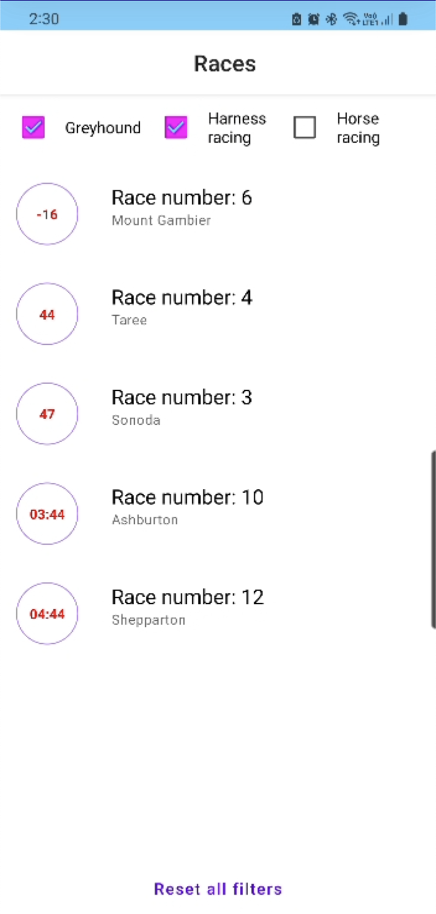
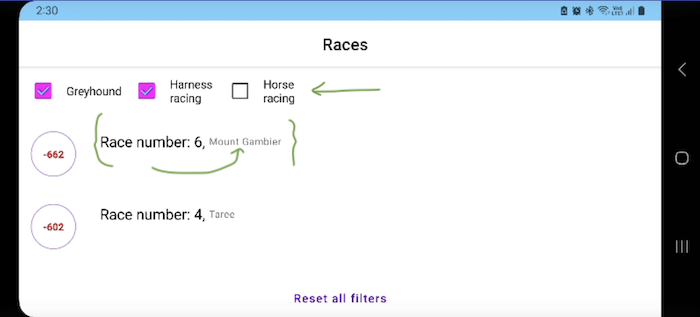

# Task

Create an Android app that displays ‘Next to Go’ races using our API.
A user should always see 5 races, and they should be sorted by time ascending. Race should disappear from the list after 1 min past the start time, if you are looking for inspiration look at https://www.neds.com.au/next-to-go


## Installation

Please clone the code and compile it in [Android Studio](https://developer.android.com/studio).


## Requirements

1.	As a user, I should be able to see a time ordered list of races ordered by advertised start ascending
2.	As a user, I should not see races that are one minute past the advertised start
3.	As a user, I should be able to filter my list of races by the following categories: Horse, Harness & Greyhound racing
4.	As a user, I can deselect all filters to show the next 5 from of all racing categories
5.	As a user I should see the meeting name, race number and advertised start as a countdown for each race.
6.	As a user, I should always see 5 races and data should automatically refresh

## Technical Requirements

-	Use Jetpack compose
-	Use Kotlin
-	Has some level of testing. Full coverage is not necessary, but there should be at least some testing for key files.
-	Documentation
-	Use scalable layouts so your app can respond to font scale changes
-	Use material design elements over custom elements
-	(Optional) use data binding
-	(Optional) add accessibility labels such that you can navigate via voiceover

Categories are defined by IDs and are the following:
- Greyhound racing: category_id: 9daef0d7-bf3c-4f50-921d-8e818c60fe61
- Harness racing: category_id: 161d9be2-e909-4326-8c2c-35ed71fb460b
- Horse racing: category_id: 4a2788f8-e825-4d36-9894-efd4baf1cfae

GET https://api.neds.com.au/rest/v1/racing/?method=nextraces&count=10
Content-type: application/json

```python
 - Greyhound racing: category_id: 9daef0d7-bf3c-4f50-921d-8e818c60fe61
 - Harness racing: category_id: 161d9be2-e909-4326-8c2c-35ed71fb460b
 - Horse racing: category_id: 4a2788f8-e825-4d36-9894-efd4baf1cfae
   # API
   GET https://api.neds.com.au/rest/***
   #Content-type: 
   application/json
```



## Technologies & Methodologies which used:
-	Jetpack Compose
-	Coroutines
-	Hilt
-	Flow
-	Clean Architecture
-	MVVM Pattern
-	LiveData
-	Espresso
-	Mockk
-	Accessibility support

## Used libraries
- [retrofit](https://square.github.io/retrofit/)
- Required data models are created with the help of [Json to Kotlin convertor](https://json2kt.com/)

## Technical challenges

- data models in response of API don't have a fixed name. Therefore we cannot use libraries such as GSON to parse the json because it needs to have a solid model. Solution is to use `LinkedTreeMap` and map it through the list:
```python
val resultEntries = data.race_summaries.map { entries ->
        Race(
            category_id = entries.value.category_id,
            meeting_name = entries.value.meeting_name,
            race_number = entries.value.race_number,
            seconds = entries.value.advertised_start.seconds.toLong()
        )
    }
```

- Offline-first: An offline-first is kind of app that is able to perform critical subset of its core functionality without access to the internet. 
We usually need database to support offline-first logic to hold data temporarily. I am using data in a list in the memory in this example to use it offline. We have 10 objects and based on the time sorting or selected filters, we only show 5 of them to users. I created a list of 10 items in the memory then apply my conditions on it. When this list becomes to 5 items, then I call the API to ger refresh data. In this method we don't call API for any filtering because it will return duplicated data.
```python
- override suspend fun getTimeFilteredRaces(
    selectedSeconds: Long,
    list: List<Race>?
): Flow<Result<List<Race>>> = flow {
    val response = if ((list?.size ?: 0) < NUMBER_OF_DISPLAYED_RACES) {
        api.getRaces().toListCharacters()
    } else {
        //offline-first
        list?.filter { it.seconds != selectedSeconds }
    }
    emit(Result.Success(response))
}
```

- Manage state with Unidirectional Data Flow:
  UI state is an immutable snapshot of the details needed for the UI to render might change over time due to user interaction or other events. ViewModel type is the recommended implementation for the management of screen-level UI state with access to the data layer. Furthermore, it survives configuration changes automatically. ViewModel classes define the logic to be applied to events in the app and produce updated state as a result.
- In this app we use Flow to send data from domain layer to UI layer. There are three actions in our repository, `getRaces`, `getTimeFilteredRaces` and `getCategoryFilteredRaces`. They flow data to vieMModel. ViewModel converts that data to UI states. Follow flowing data, state will be updated and Composable items are observing states. When something is changed in the state, Ui will be automatically updated.
- Our single source of UI's data is state that we define in viewModel. Therefore any change in the UI will follow states. An example is checkbox. When user clicks on it and change it from selected to unselected, we don't change the UI state. Data will be passed to viewModel, then repository will apply the logic and reproduce a new data to viewModel. viewModel will create a new state and then UI will be updated following on updated state.



Repository:
```python
    suspend fun getTimeFilteredRaces(
        selectedSeconds: Long,
        list: List<Race>?
    ): Flow<Result<List<Race>>>
```

viewModel:
```python
private val _uiState = MutableStateFlow(HomeState())
    val state = _uiState.asStateFlow()
    
    ...
    
_uiState.update { homeState ->
                        homeState.copy(
                            characters = offlineList?.take(NUMBER_OF_DISPLAYED_RACES)
                                ?: emptyList(),
                            isLoading = false,
                            filterList = _filterList,
                            timeStamp = currentTimestamp
                        )
                    }
```
There is also another layer of data flow between viewModel and composables. We trigger events with this flow to tell UI we need to show a message to user.
Repository:
```python
@Composable
fun HomeScreen(
onItemClicked: (Int) -> Unit,
viewModel: HomeViewModel = hiltViewModel()
) {
val uiState by viewModel.state.collectAsState()
val eventFlow = viewModel.eventFlow
```


- adaptive layouts to support different form-factors.
We check size of the display. If that is larger than a a specific size, then alignment of views instead of vertical views will be on a horizontal line.

 

```python
if (maxWidth < 400.dp) {
    Column(
        modifier = Modifier
            .fillMaxWidth()
    ) {
        Text(
...
} else {
    Row(
        verticalAlignment = Alignment.CenterVertically,
        modifier = Modifier
            .fillMaxWidth()
    ) {
        Text(
```

# accessibility support
- Large font support: if user changes font size to maximum, it can break our UI. solution is to check for Ellipsis or change order of UI elements in large font size:
  Luckily the Text composable provides a callback for intercepting the calculation of the Text layout called `onTextLayout`
```python
Text(
    text = "Race number: ${item.race_number}",
    overflow = TextOverflow.Ellipsis,
    fontSize = textSize,
    onTextLayout = { textLayoutResult ->
        val maxCurrentLineIndex: Int = textLayoutResult.lineCount - 1
        if (textLayoutResult.isLineEllipsized(maxCurrentLineIndex)) {
            textSize = textSize.times(TEXT_SCALE_REDUCTION_INTERVAL)
        }
    }
)
```
- Grouping layouts to have a bigger area for clicks: Checkbox has a tick and a text. We group these two and assign the delegate to the container This was we have larger clickable area and united contentDescription
This ca be achieved by
```python
@Composable
fun GroupedCheckbox(mItemList: List<String>, viewModel: HomeViewModel, filterList: Array<Boolean>) {
    mItemList.forEachIndexed { index, item ->
        Row(
            modifier = Modifier
                ...
                .semantics(mergeDescendants = true) { }
                .toggleable(
                    value = isChecked,
                    enabled = true,
                    role = Role.Checkbox,
                    onValueChange = { viewModel.setFilter(index, it) },
                ),
            ) {
            Checkbox(
                checked = isChecked,
                onCheckedChange = null,
                ...
            )
            Text(text = item)
```


Please make sure to update tests as appropriate.

## License

[MIT](https://choosealicense.com/licenses/mit/)