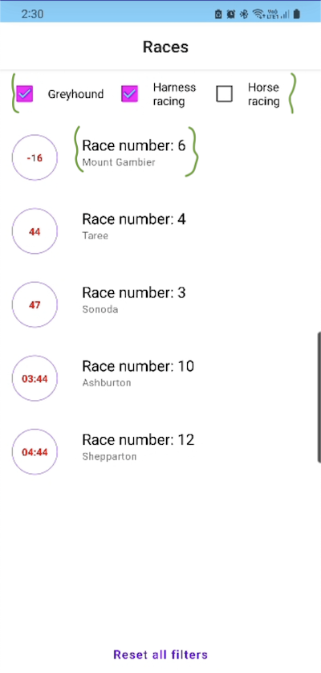

# Task

Create an Android app that displays ‘Next to Go’ races using our API.
A user should always see 5 races, and they should be sorted by time ascending. Race should disappear from the list after 1 min past the start time, if you are looking for inspiration look at https://www.neds.com.au/next-to-go


## Installation

Please clone the code and compile it in [Android Studio](https://developer.android.com/studio).


## Requirements

1.	As a user, I should be able to see a time ordered list of races ordered by advertised start ascending
2.	As a user, I should not see races that are one minute past the advertised start
3.	As a user, I should be able to filter my list of races by the following categories: Horse, Harness & Greyhound racing
4.	As a user, I can deselect all filters to show the next 5 from of all racing categories
5.	As a user I should see the meeting name, race number and advertised start as a countdown for each race.
6.	As a user, I should always see 5 races and data should automatically refresh

## Technical Requirements

-	Use Jetpack compose
-	Use Kotlin
-	Has some level of testing. Full coverage is not necessary, but there should be at least some testing for key files.
-	Documentation
-	Use scalable layouts so your app can respond to font scale changes
-	Use material design elements over custom elements
-	(Optional) use data binding
-	(Optional) add accessibility labels such that you can navigate via voiceover

Categories are defined by IDs and are the following:
- Greyhound racing: category_id: 9daef0d7-bf3c-4f50-921d-8e818c60fe61
- Harness racing: category_id: 161d9be2-e909-4326-8c2c-35ed71fb460b
- Horse racing: category_id: 4a2788f8-e825-4d36-9894-efd4baf1cfae

GET https://api.neds.com.au/rest/v1/racing/?method=nextraces&count=10
Content-type: application/json

```python
 - Greyhound racing: category_id: 9daef0d7-bf3c-4f50-921d-8e818c60fe61
 - Harness racing: category_id: 161d9be2-e909-4326-8c2c-35ed71fb460b
 - Horse racing: category_id: 4a2788f8-e825-4d36-9894-efd4baf1cfae
   # API
   GET https://api.neds.com.au/rest/***
   #Content-type: 
   application/json
```
## Technologies & Methodologies which used:
-	Jetpack Compose
-	Coroutines
-	Hilt
-	Flow
-	Clean Architecture
-	MVVM Pattern
-	LiveData
-	Espresso
-	Mockk
-	Accessibility support

## Used libraries
- [retrofit](https://square.github.io/retrofit/)
- Required data models are created with the help of [Json to Kotlin convertor](https://json2kt.com/)

## Challenges

- data models in response of API don't have a fixed name. Therefore we cannot use libraries such as GSON to parse the json because it needs to have a solid model. Solution is to use `LinkedTreeMap` and map it through the list:
```python
val resultEntries = data.race_summaries.map { entries ->
        Race(
            category_id = entries.value.category_id,
            meeting_name = entries.value.meeting_name,
            race_number = entries.value.race_number,
            seconds = entries.value.advertised_start.seconds.toLong()
        )
    }
```
- Form-Factor support. We check size of the display. If that is larger than a a specific size, then alignment of views instead of vertical views will be on a horizontal line.

![screenshots/vertical.png] ![screenshots\horizontal.png]

 
- 


Please make sure to update tests as appropriate.

## License

[MIT](https://choosealicense.com/licenses/mit/)